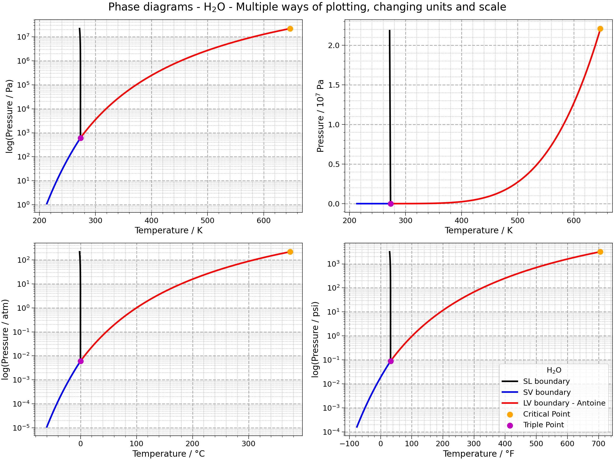

# Phase diagram



A simple script to plot phase diagrams.

A phase diagram in physical chemistry, engineering, mineralogy, and materials
science is a type of chart used to show conditions (pressure, temperature, volume, etc.)
 at which thermodynamically distinct phases (such as solid, liquid or gaseous states)
 occur and coexist at equilibrium. [More details on Wikipedia](https://en.wikipedia.org/wiki/Phase_diagram).

Peter Atkins defines in his  book *Physical Chemistry* that "**phase** identifies a state
of matter, not only about the chemical composition, but also concerning its physical state". This book that can be found at [Amazon](https://www.amazon.com/Physical-Chemistry-9th-Peter-Atkins/dp/1429218126/ref=sr_1_5?keywords=physical+chemistry+nine+edition&qid=1583607029&sr=8-5)


# Installation and requirements

This project relies mainly on [SciPy](https://matplotlib.org/),
[Matplotlib](https://numpy.org/), [numpy](https://numpy.org/),
[Pandas](https://pandas.pydata.org/) and [Pint](https://pint.readthedocs.io/en/stable/).

<!-- TODO atualizar para pipenv -->

Just clone or download this repo. This is not a package yet. We recommend
creating a environment and install the requirements from the `requirements.txt` file.
Assuming that you cloned the repo in a folder called `phase_diagram` and that
you will name the environment as `.env`:

```bash
cd phase_diagram
pip install venv
python3 -m venv .env
source .env/bin/activate
```
Verify the python path. It must be related to your project folder:

```bash
which python
```

Finally, install the requirements:

```bash
pip install -r requirements.txt
```

# Usage

See the [tutorial](phase_diagram_tutorial.ipynb)


# Contributing

All contributions are welcome.

**Issues**

Feel free to submit issues regarding:

- recommendations
- more examples for the tutorial
- enhancement requests and new useful features
- code bugs

**Pull requests**

- before starting to work on your pull request, please submit an issue first
- fork the repo
- clone the project to your own machine
- commit changes to your own branch
- push your work back up to your fork
- submit a pull request so that your changes can be reviewed

# License

MIT, see [LICENSE](LICENSE)

# Citing

If you use this project in a scientific publication or in classes, please consider citing as

F. L. S. Bustamante & F. H. J. F Da Silva, Phase diagram, 2020 - Available at: https://github.com/fhfraga/phase_diagram
