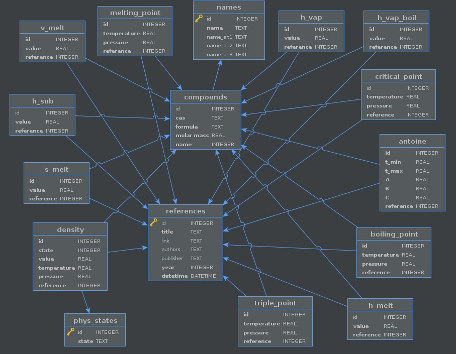

# Database structure and info

## Information about the tables
This project uses a database containing 16 tables, which are:

| Tables           | Meaning                                                 |
| ---------------- | ------------------------------------------------------- |
| 'antoine'        | Antoine parameters                                      |
| 'boiling_point'  | Parameters for the boiling point                        |
| 'compounds'      | data on compounds                                       |
| 'critical_point' | Parameters for the critical point                       |
| 'density'        | Density values for certain parameters                   |
| 'h_melt'         | Melting enthalpy values                                 |
| 'h_sub'          | Sublimation enthalpy values                             |
| 'h_vap'          | Vaporization enthalpy values                            |
| 'h_vap_boil '    | Vaporization enthalpy values (at the boiling point)     |
| 'melting_point   | Parameters for the melting point                        |
| 'names'          | Names of substances (common and alternative)            |
| 'phys_states'    | Physical states                                         |
| 'references'     | References used for the data                            |
| 's_melt'         | Entropy change of fusion                                |
| 'triple_point'   | Parameters for the triple point                         |
| 'v_melt'         | Volume change on fusion                                 |

**Note:** All tables have an `id` column that refers to the compound index. The only exceptions are the `references` and `phys_states` tables, since their indexes refer, respectively, to each reference placed in this database and to the physical states of the compounds.

Below is an image of how the interaction between tables works.

## Units used:
We use the following units for physical and chemical quantities in the database

| Quantity         | Unit                              |
| ---------------- | --------------------------------- |
| Pressure         | pascal (Pa)                       |
| Temperature      | kelvin (K)                        |
| Molar mass       | gram per mol (g/mol)              |
| Enthalpy         | kilojoule per mol (kJ/mol)        |
| Entropy          | kilojoule per kelvin (kJ/K)       |
| Volume           | cubic centimeter (cm³)            |

In the code, for clarity and for quantities not shown in the database, below is a table with the units used for specific quantities.

| Name                    | Meaning                                     | Unit           |
| ----------------------- | ------------------------------------------- | -------------- |
| 'gas_constants'         | gas constant                                | J/mol * K      |
| 'molar_mass'            | molar mass of the compound                  | gram/mol       |
| 'density_solid'         | density of the compound in the solid state  | gram/cm³       |
| 'density_solid'         | density of the compound in the liquid state | gram/cm³       |
| 'antoine'               | Antoine parameter A, B and C                | diomensionless |
| 'boiling_point'         | boiling point value                         | Pa, K          |
| 'melting_point'         | melting point value                         | Pa, K          |
| 'triple_point'          | triple point value                          | Pa, K          |
| 'critical_point'        | critical point value                        | Pa, K          |
| 'enthalpy_fusion'       | melting enthalpy value                      | kJ/mol         |
| 'enthalpy_sublimation'  | sublimation enthalpy value                  | kJ/mol         |
| 'enthalpy_vaporization' | vaporization enthalpy value                 | kJ/mol         |
| 'volume_change_fusion   | melting volume                              | cm³/mol        |

## Other functions

The code also has functions without units, which serve to know other information about the compounds.

| Name              | Meaning                                  |
| ----------------- | ---------------------------------------- |
| 'idx'             | View the composite index in the database |
| 'cas'             | compound CAS number                      |
| 'formula'         | chemical formula of the compound         |
| 'name'            | name of the compound                     |
| 'alternative_name | alternative name of the compound         |

**Note:** This database may undergo constant changes. We ask that you always check this repository for new data.