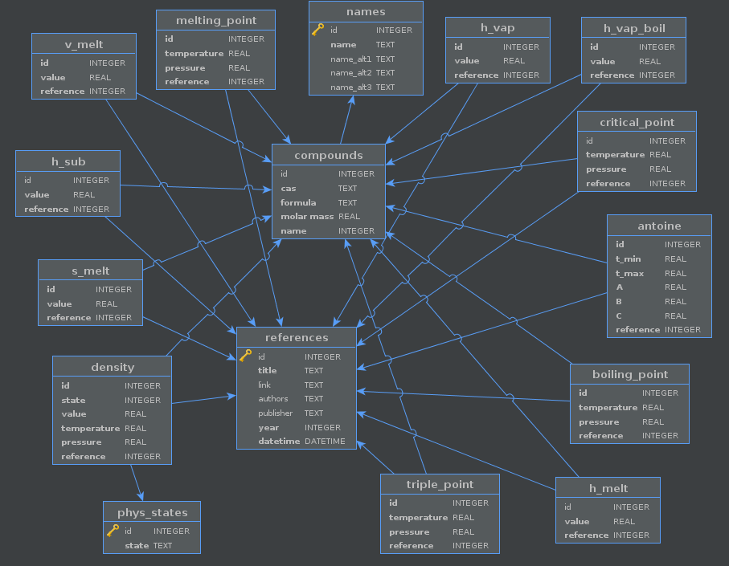

# Database structure and info

## Information about the tables

This project uses a database containing 16 tables, which are:

| Tables           | Meaning                                                 |
| ---------------- | ------------------------------------------------------- |
| 'antoine'        | Antoine parameters                                      |
| 'boiling_point'  | Boiling point temperature and pressure |
| 'compounds'      | Compounds formulas, molar mass and main name |
| 'critical_point' | Critical point temperature and pressure |
| 'density'        | Density values                   |
| 'h_melt'         | Melting enthalpy values                                 |
| 'h_sub'          | Sublimation enthalpy values                             |
| 'h_vap'          | Vaporization enthalpy values                            |
| 'h_vap_boil '    | Vaporization enthalpy values (at the boiling point)     |
| 'melting_point   | Parameters for the melting point                        |
| 'names'          | Names of substances (common and alternative)            |
| 'phys_states'    | Physical states                                         |
| 'references'     | References used for the data                            |
| 's_melt'         | Entropy change of fusion                                |
| 'triple_point'   | Triple point temperature and pressure |
| 'v_melt'         | Volume change on fusion                                 |

**Note:** All tables have an `id` column that refers to the compound index. The only exceptions are the `references` and `phys_states` tables, since their indexes refer, respectively, to each reference placed in this database and to the physical states of the compounds.

Below is an Entity Relationship Diagram (ERD) for the database:

## Units used:

Physical and chemical quantities in the database, unless stated otherwise, are stored in the following units:

| Quantity         | Unit                              |
| ---------------- | --------------------------------- |
| Pressure         | pascal (Pa)                       |
| Temperature      | kelvin (K)                        |
| Molar mass       | gram per mol (g/mol)              |
| Enthalpy         | kilojoules per mole (kJ/mol)        |
| Entropy          | joules per mole per kelvin (J/(mol K))       |

The following units are used for specific quantities:

| Name                    | Meaning                                     | Unit           |
| ----------------------- | ------------------------------------------- | -------------- |
| 'gas_constants'         | gas constant                                | J/(mol * K)      |
| 'molar_mass'            | molar mass of the compound                  | gram/mol       |
| 'density_solid'         | density of the compound in the solid state  | gram/cm³       |
| 'density_liquid'         | density of the compound in the liquid state | gram/cm³       |
| 'antoine'               | Antoine parameters A, B and C                | dimensionless* |
| 'boiling_point'         | boiling point (temperature, pressure) | K, Pa          |
| 'melting_point'         | melting point (temperature, pressure) | K, Pa          |
| 'triple_point'          | triple point (temperature, pressure) | K, Pa |
| 'critical_point'        | critical point (temperature, pressure) | K, Pa |
| 'enthalpy_fusion'       | melting enthalpy value                      | kJ/mol         |
| 'enthalpy_sublimation'  | sublimation enthalpy value                  | kJ/mol         |
| 'enthalpy_vaporization' | vaporization enthalpy value                 | kJ/mol         |
| 'volume_change_fusion   | volume change in fusion | cm³/mol        |

*The Antoine parameters are for pressure in mmHg and temperature in Celsius. The PhaseDiagram class has a method `antoine_si` to convert the parameters to values compatible with SI units (Pascal and Kelvin).

## Other functions

The following attributes are dimensionless.

| Name              | Meaning                                  |
| ----------------- | ---------------------------------------- |
| 'idx'             | compound index in the database |
| 'cas'             | compound CAS number                      |
| 'formula'         | chemical formula of the compound         |
| 'name'            | name of the compound                     |
| 'alternative_name | alternative name(s) of the compound         |

**Note:** This database may undergo constant changes. We ask you to always check this repository for new data.